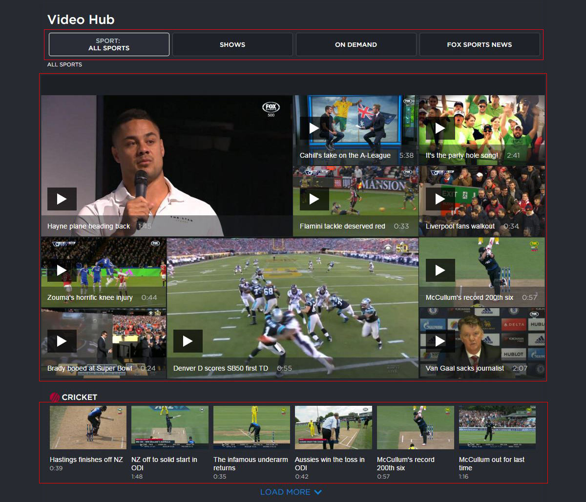

class: center, middle, inverse, hero

# Just a bunch of tasty, real-life FRP examples 🥓

---

class: center, middle, inverse

# How we use Bacon.js to deal with complex datasets for React

---

class: center, middle, inverse

Instead of nesting all the things...

```js
axios
  .get(`match-details/${matchId}`)
  .then(response => {
    const matchDetails = response.data;

    axios
      .get(`team-details/${matchDetails.fixtureId}`)
      .then(response => {
        const teamDetails = response.data;

        ReactDOM.render(
          <Component match={matchDetails} team={teamDetails} />,
          document.getElementById('root')
        );
      });
  });
```

---

class: center, middle, inverse

We can streamline the requests:

```js
const matchDetailsStream = Bacon.fromPromise(
  axios.get(`match-details/${matchId}`)
);

const teamDetailsStream = matchDetailsStream.flatMapLatest(
  matchDetails => Bacon.fromPromise(
    axios.get(`team-details/${matchDetails.fixtureId}`)
  );
);

const viewProps = Bacon.combineTemplate({
  matchDetails: matchDetailsStream,
  teamDetails: teamDetailsStream
});

viewProps.onValue(props => {
  ReactDOM.render(<Component {...props} />, document.getElementById('root'));
});
```

---

class: center, middle, inverse

# Some other cool things we can do with Bacon.js

(or FRP in general)

---

class: center, middle, inverse

Map specific values

```js
const matchDetails = getMatchDetails(12345);

// ANZ Stadium
const venueName = matchDetails.map(
  matchDetails => matchDetails.venueName
);

// Feb 8th 2016
const matchDate = matchDetails.map(
  matchDetails => moment(matchDetails.startDate).format('MMM Do YYYY')
);
```

---

class: center, middle, inverse

Generate new streams, based on previous streams

```js
const matchDetails = getMatchDetails(12345);

const teamA = matchDetails.flatMapLatest(
  matchDetails => getTeamDetails(matchDetails.team_a.id)
);

const teamB = matchDetails.flatMapLatest(
  matchDetails => getTeamDetails(matchDetails.team_b.id)
);
```

???

e.g. new API endpoints

---

class: center, middle, inverse

Generate new streams, based on previous streams (cont'd)

```js
Bacon.combineTemplate({
  venueName,
  matchDate,
  teamA,
  teamB
}).onValue(props => {
  ReactDOM.render(
    <Component {...props} />,
    document.getElementById('root')
  );
});
```

---

class: center, middle, inverse

User interactions:<br />dealing with user input

```js
const userSelectedIdBus = new Bacon.bus();

const selectedId = userSelectedIdBus
  .map(userClickDetails => userClickDetails.newId)
  .startWith(1); // starting id of 1, before the user clicks.

const matchDetails = selectedId.flatMapLatest(
  selectedId => getMatchDetails(selectedId)
);

Bacon.combineTemplate({
  matchDetails,
  onSelectId: details => { userSelectedIdBus.push(details); }
}).onValue(props => {
  ReactDOM.render(<Component {...props} />, document.getElementById('root'));
});
```

---

class: center, middle, inverse

Composing views

```js
function getMosaicDataStream() {
  return Bacon.combineTemplate({
    videos: getVideosFromCategory(123)
  });
}

const mosaicComponent = getMosaicDataStream().map(
  data => <MosaicComponent {...data} />
);

const filterComponent = getFilterStream().map(
  data => <HubComponent {...data} />
);

Bacon
  .combineTemplate({
    mosaicComponent,
    filterComponent
  })
  .onValue(props => {
    ReactDOM.render(<Component {...props} />, document.getElementById('root'));
  });
```

---

class: center, middle, inverse

```js
class HubComponent extends React.Component {
  render: {
    return (
      <div>
        {this.props.mosaicComponent}
        {this.props.filterComponent}
      </div>
    );
  }
}
```

---

class: center, middle, video-hub-slide



---

class: center, middle, inverse, hero, contact-details

## .secondary[Slides:] https://talks.fknussel.com/frp-examples

## .secondary[Email:] fknussel@gmail.com

## .secondary[Twitter/GitHub:] @fknussel
